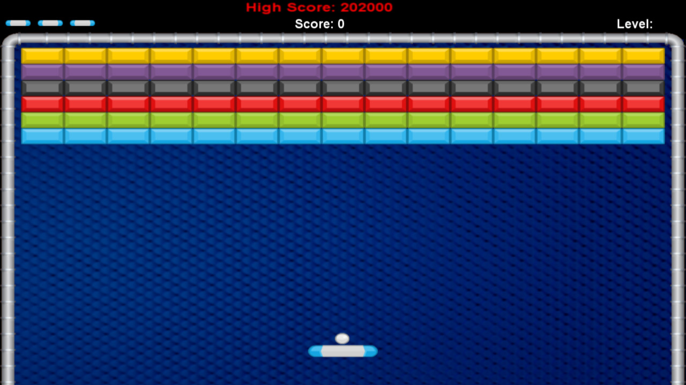

# *22Fall CSE230 Project*: Brick Breaker Game

**Group Member**: Hanlin Teng, Spencer Du, Wenzao Cui, Yunshu Zhou

## Proposal

### Project Description

We plan to build a brick breaker game where players can smash overhead walls with a perpetually bouncing ball. Players are able to move a board to catch and deflect the ball upwards. The game ends when the ball hits the ground (the player fails to bounce back the ball with the board) or the time limit is reached. The players should attempt to destroy wall pieces as many as possible to achieve highest scores in the time limit. We plan to add some extra features based on the traditional brick break game. Based on our Google search, there’s no existing implementation of the game with the `Brick` library.

<!--  -->

```
<center></img></center>
```

### Goal/Features

We plan to first build a basic version of the game that follows simplified rules, and then add different features incrementally from there. The functionalities we aim to achieve are outlined below :

#### Basic game logic

This includes generating the brick map, bouncing the ball in different directions, boundary detections, and keeping track of the status of each brick, etc.

#### User interface

We want to build a user-friendly homepage and other game pages that allow players to Enter, Quit, Restart, or Pause the game.

#### Features

- **Chances**: Players have multiple chances during one game. Every time they fail to catch the ball, a chance will be used, until there’s no chance available.

- **Time limit**: The game is timed so we need to implement a countdown timer.

- **Buff, debuff**: The game should be able to randomly generate buffs or debuffs that have a positive or negative impact on the game, e.g., the ability to move the board faster.

- **Scores**: The game should compute and keep track of the scores for each round (basic) and display the ranking (i.e. highest scores achieved) when it ends (stretch goal).

- **Levels**: We want to design multiple game levels and more diversified layouts with easy, medium, and hard difficulties. (stretch goal)

### Timeline

- 11.9 proposal submission
- 11.19 Milestone1: basic functionality
- 12.3 Milestone2: add-ons
- 12.9 final presentation

### References

- [Brick](https://github.com/jtdaugherty/brick)
- [Brick Breaker Game ScreenShot](https://store.steampowered.com/app/874780/Brick_Breaker_Premium/)
