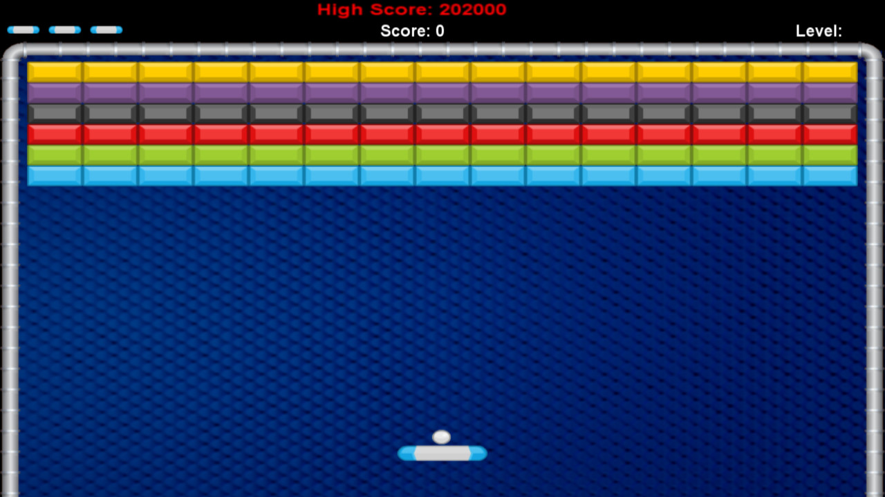

# CSE 230 Project Proposal: Brick Breaker Game

**Group Member**: Hanlin Teng  Spencer Du  Wenzao Cui  Yunshu Zhou

 
## Project Description
We plan to build a brick breaker game where players can smash walls by deflecting a bouncing ball. Players are able to move a board to catch the ball. Game ends when the ball hits the ground or the time limit is reached. We plan to add some extra features based on the traditional brick break game. Based on our Google search, there’s no existing implementation of the game with brick.

## Goal/Features
We plan to first build a basic version that follows simplified rules, and add on different features from there. Here we outlined the functionalities that we aim to achieve:
### Basic game logic
This includes generating the brick map, bouncing balls in different directions, boundary detections, and keeping track of the status of each brick, etc.
### User interface
We want to build user friendly home and in game pages that allows players to Enter, Quit, Restart, or Pause the game.
### Features
 -  Chances: Players have multiple chances during one game. Every time they fail to catch the ball, another chance will be used, until there’s no chance available.
-   Time limit: The game is timed so we need to implement a countdown timer.
    
-   Buff, debuff: The game should be able to randomly generate buffs or debuffs that have positive or negative impact on the game. E.g. Ability to move the board faster.
    
-   Scores: The game should compute and keep track of the scores for each game and display the ranking (i.e. highest scores achieved) when it ends. (Stretch Goal)
    
-   Levels: We want to design multiple game levels with easy, medium, and hard difficulties. (Stretch Goal)

    
## Timeline
-   11.9 submit proposal
-   xx.xx Milestone1: basic func
-   xx.xx Milestone2: addons
-   12.9 final presentation

## References
- [Brick](https://github.com/jtdaugherty/brick)
- [Brick Breaker Game ScreenShot](https://store.steampowered.com/app/874780/Brick_Breaker_Premium/)
